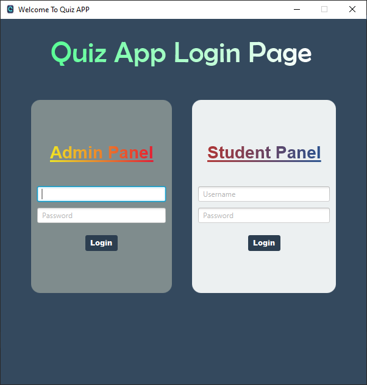
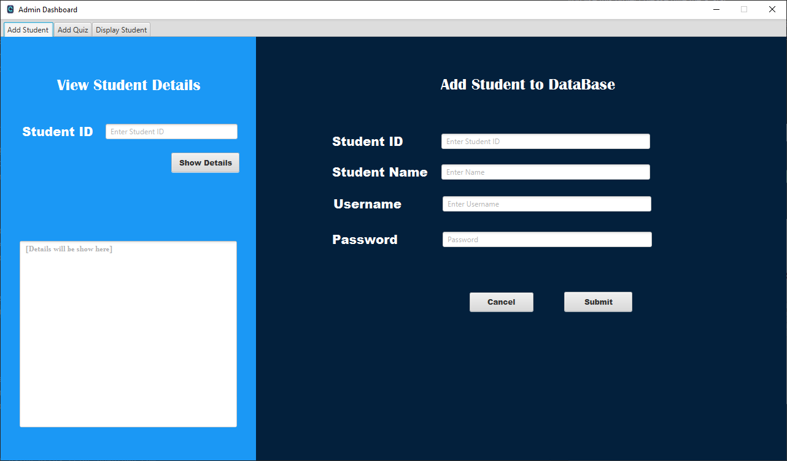
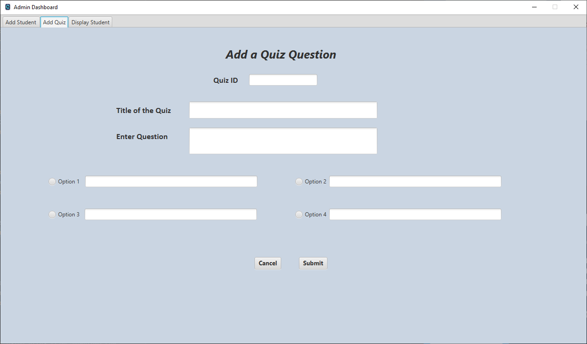
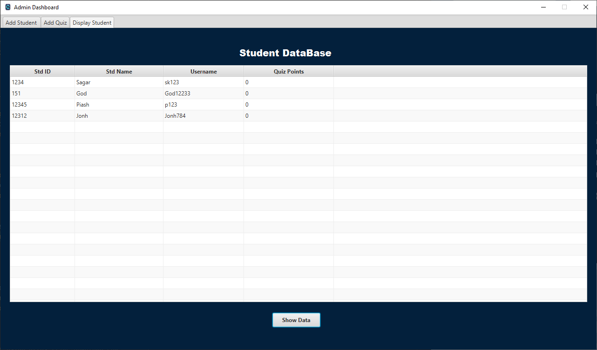
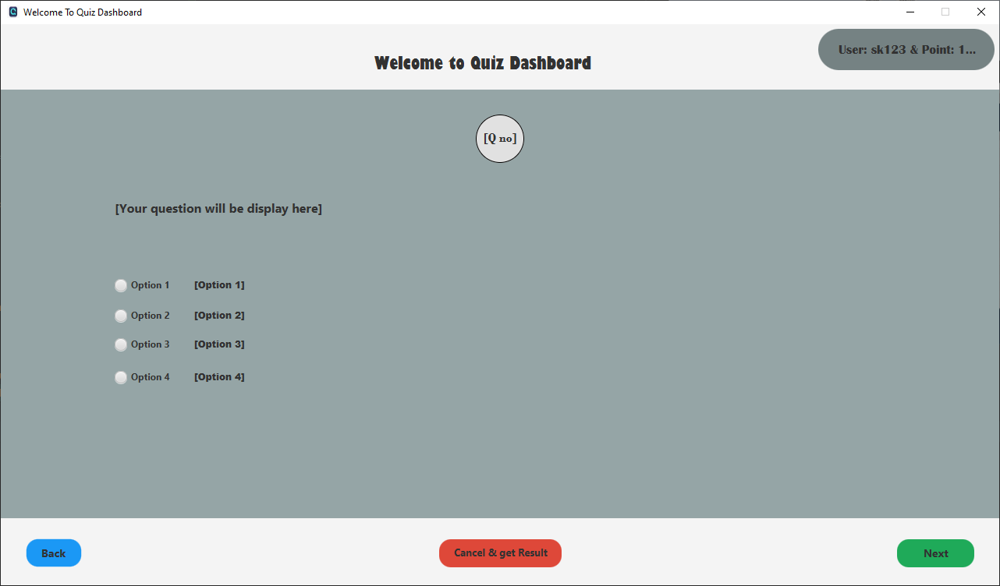
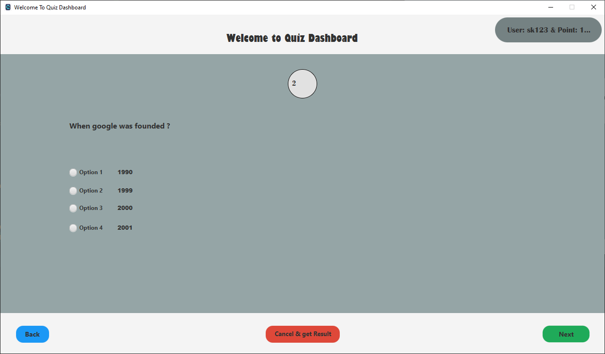
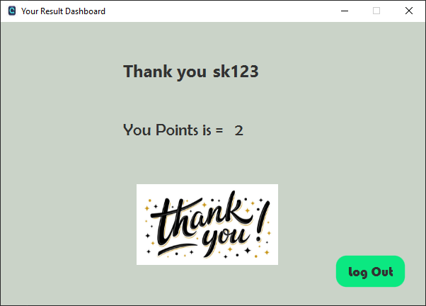

# QuizApp
A database Based Quiz Application

Hello Everyone. This is an open source project by me. Fill free to contribute to this project. 
If you like this project please give me a Star.

This was my first Database Based Project and if you find anything wrong please create an issue,
and I will fix it also fill free to contribute in my project.
Thank you.

Some Screen Shot of this project

`Login Page`

`UserName: Admin`
`Password: 1234`

`Admin Dashboard`

`Admin add Quiz`

`Admin Show all students`

Student Dashboard
`UserName: 1234`
`Password: 1234`

`Finally showing result`

© Sagar Karmoker
